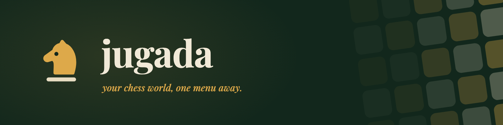
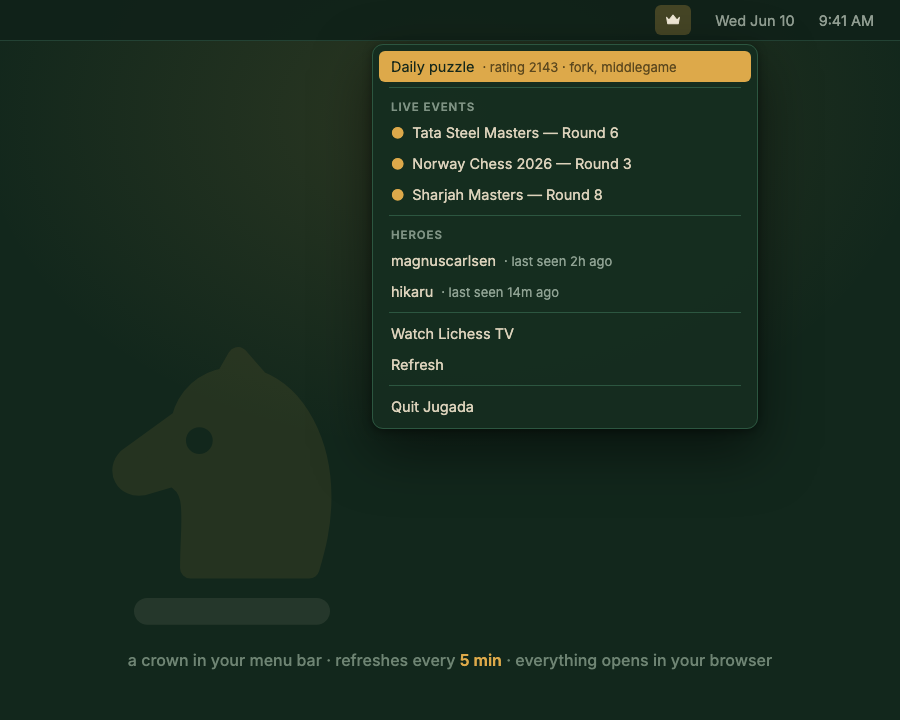

<div align="center">



**A tiny chess companion for the macOS menu bar** — the daily puzzle, live broadcasts,
and your chess heroes, one click away, all day. No accounts, no keys, no tracking.

[](https://github.com/SethMed7/jugada/releases/latest)
[](LICENSE)
[](#install)
[](#features)

</div>

**jugada** — Spanish for *"the move."* It puts a crown ♔ in your menu bar; click it and the
board unfolds: today's [lichess](https://lichess.org) puzzle with its rating and themes, the
official broadcasts playing right now, when your favorite players were last online, and a
one-click ticket to Lichess TV. Everything opens in your browser. The menu refreshes itself
every five minutes. No login, nothing to configure to start. Part of a small family —
sibling of [narrado](https://github.com/SethMed7/narrado) and
[leelo](https://github.com/SethMed7/leelo) — same craft, a different board.

## How it works



## Features

- **Daily puzzle** — rating and themes at a glance; one click opens
  [lichess training](https://lichess.org/training/daily)
- **Live events** — up to five official lichess broadcasts (Tata Steel, Norway Chess…),
  each one click from the live board
- **Heroes** — your favorite chess.com players and when they were last seen; choose them
  in `~/.jugada/config.json`
- **Watch Lichess TV** — the best game on lichess, instantly
- **Self-refreshing** — every 5 minutes, plus a manual **Refresh**; each section degrades
  gracefully when you're offline
- **Private by design** — no accounts, no keys, no tracking; talks only to `lichess.org`
  and `api.chess.com`

## Install

1. Download `Jugada-x.y.z.zip` from [Releases](https://github.com/SethMed7/jugada/releases/latest),
   unzip, drag **Jugada.app** to Applications, and open it. The app is ad-hoc signed; if macOS
   complains, run `xattr -dr com.apple.quarantine /Applications/Jugada.app` (or right-click → Open).
2. That's it — **no permissions to grant.** jugada talks only to `lichess.org` and
   `api.chess.com`.

To follow your own heroes, edit `~/.jugada/config.json` (created on first run):

```json
{ "heroes": ["magnuscarlsen", "hikaru"] }
```

## Development

```sh
swift build              # debug build
sh scripts/bundle.sh     # release build -> build/Jugada.app (no Xcode project needed)
./build/Jugada.app/Contents/MacOS/Jugada --check   # headless snapshot of all sections
```

Brand assets are authored as HTML/SVG in `assets/` and rendered with
`bunx playwright screenshot`.

## License

MIT

<div align="center">
<sub>♞ <b>jugada</b> · brass on board-green · your chess world, one menu away · part of the
family: <a href="https://github.com/SethMed7/narrado">narrado</a> ·
<a href="https://github.com/SethMed7/leelo">leelo</a> ·
<a href="https://github.com/SethMed7/dictado">dictado</a></sub>
</div>
